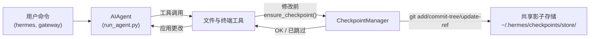

# 检查点与 `/rollback`

Hermes Agent 可以在**破坏性操作**之前自动为您的项目创建快照，并通过单个命令恢复。从 v2 版本开始，检查点是**可选功能**——大多数用户从未使用过 `/rollback`，并且影子存储会随时间增长，因此默认是关闭的。

通过 `--checkpoints` 为每个会话启用检查点：

```bash
hermes chat --checkpoints
```

或者在 `~/.hermes/config.yaml` 中全局启用：

```yaml
checkpoints:
  enabled: true
```

此安全网由一个内部的**检查点管理器**提供支持，该管理器在 `~/.hermes/checkpoints/store/` 下维护一个共享的影子 Git 仓库——您的真实项目 `.git` 永远不会被触及。Agent 工作的每个项目都共享同一个存储，因此 Git 的内容寻址对象数据库会在项目和对话轮次之间进行去重。

## 什么会触发检查点

检查点在以下操作之前自动创建：

- **文件工具** — `write_file` 和 `patch`
- **破坏性终端命令** — `rm`、`rmdir`、`cp`、`install`、`mv`、`sed -i`、`truncate`、`dd`、`shred`、输出重定向 (`>`) 以及 `git reset`/`clean`/`checkout`

Agent 在**每个目录每轮对话中最多创建一个检查点**，因此长时间运行的会话不会产生大量快照。

## 快速参考

会话内的斜杠命令：

| 命令 | 描述 |
|---------|-------------|
| `/rollback` | 列出所有检查点及其变更统计信息 |
| `/rollback <N>` | 恢复到检查点 N（同时撤销最后一轮聊天） |
| `/rollback diff <N>` | 预览检查点 N 与当前状态之间的差异 |
| `/rollback <N> <file>` | 从检查点 N 恢复单个文件 |

用于在会话外检查和管理存储的 CLI 命令：

| 命令 | 描述 |
|---------|-------------|
| `hermes checkpoints` | 显示总大小、项目数量、每个项目的细分信息 |
| `hermes checkpoints status` | 与裸 `checkpoints` 命令相同 |
| `hermes checkpoints list` | `status` 的别名 |
| `hermes checkpoints prune` | 强制执行清理：删除孤立/过时条目，进行 GC，强制执行大小上限 |
| `hermes checkpoints clear` | 清除整个检查点存储库（会先询问） |
| `hermes checkpoints clear-legacy` | 仅删除 v1 迁移产生的 `legacy-*` 归档文件 |

## 检查点的工作原理

从高层次看：

- Hermes 检测到工具即将**修改**工作树中的文件。
- 每轮对话（每个目录）一次，它会：
  - 为文件解析出一个合理的项目根目录。
  - 在 `~/.hermes/checkpoints/store/` 初始化或重用**单个共享影子存储**。
  - 暂存到每个项目的索引中，构建一个树，并提交到每个项目的引用 (`refs/hermes/<project-hash>`)。
- 这些每个项目的引用构成了一个检查点历史记录，您可以通过 `/rollback` 进行检查和恢复。


```mermaid
flowchart LR
  user["用户命令\n(hermes, gateway)"]
  agent["AIAgent\n(run_agent.py)"]
  tools["文件与终端工具"]
  cpMgr["CheckpointManager"]
  store["共享影子存储\n~/.hermes/checkpoints/store/"]

  user --> agent
  agent -->|"工具调用"| tools
  tools -->|"修改前\nensure_checkpoint()"| cpMgr
  cpMgr -->|"git add/commit-tree/update-ref"| store
  cpMgr -->|"OK / 已跳过"| tools
  tools -->|"应用更改"| agent
```

## 配置

在 `~/.hermes/config.yaml` 中配置：

```yaml
checkpoints:
  enabled: false              # 主开关 (默认: false — 可选)
  max_snapshots: 20           # 每个项目的最大检查点数（通过引用重写 + gc 强制执行）
  max_total_size_mb: 500      # 存储总大小的硬性上限；最旧的提交会被丢弃
  max_file_size_mb: 10        # 跳过任何大于此值的单个文件

  # 自动维护（默认开启）：在启动时扫描 ~/.hermes/checkpoints/
  # 并删除工作目录已不存在（孤立）或 last_touch 早于 retention_days 的项目条目。
  # 通过 .last_prune 标记跟踪，最多每 min_interval_hours 运行一次。
  auto_prune: true
  retention_days: 7
  delete_orphans: true
  min_interval_hours: 24
```

要禁用所有功能：

```yaml
checkpoints:
  enabled: false
  auto_prune: false
```

当 `enabled: false` 时，检查点管理器不执行任何操作，并且从不尝试 Git 操作。当 `auto_prune: false` 时，存储会一直增长，直到您手动运行 `hermes checkpoints prune`。

## 列出检查点

在 CLI 会话中：

```
/rollback
```

Hermes 会以格式化列表响应，显示变更统计信息：

```text
📸 项目 /path/to/project 的检查点：

  1. 4270a8c  2026-03-16 04:36  应用 patch 前  (1 个文件, +1/-0)
  2. eaf4c1f  2026-03-16 04:35  应用 write_file 前
  3. b3f9d2e  2026-03-16 04:34  应用终端命令前: sed -i s/old/new/ config.py  (1 个文件, +1/-1)

  /rollback <N>             恢复到检查点 N
  /rollback diff <N>        预览自检查点 N 以来的更改
  /rollback <N> <file>      从检查点 N 恢复单个文件
```

## 从 Shell 检查存储

```bash
hermes checkpoints
```

示例输出：

```text
检查点基础目录: /home/you/.hermes/checkpoints
总大小:      142.3 MB
  store/         138.1 MB
  legacy-*       4.2 MB
项目数量:        12

  工作目录                                                      提交数    最后访问时间   状态
  /home/you/code/hermes-agent                                        20       2小时前  活跃
  /home/you/code/experiments/rl-runner                                8       1天前   活跃
  /home/you/code/old-prototype                                        3       9天前   孤立
  ...

遗留归档 (1):
  legacy-20260506-050616                           4.2 MB

使用以下命令清除: hermes checkpoints clear-legacy
```

强制执行全面清理（忽略 24 小时幂等性标记）：

```bash
hermes checkpoints prune --retention-days 3 --max-size-mb 200
```

## 使用 `/rollback diff` 预览更改

在提交恢复之前，预览自某个检查点以来的更改：

```
/rollback diff 1
```

这将显示一个 git diff 统计摘要，然后是实际的差异。

## 使用 `/rollback` 恢复

```
/rollback 1
```

在幕后，Hermes 会：

1. 验证目标提交存在于影子存储中。
2. 为当前状态创建一个**回滚前快照**，以便您稍后可以“撤销撤销”。
3. 恢复工作目录中已跟踪的文件。
4. **撤销最后一轮对话**，使 Agent 的上下文与恢复后的文件系统状态匹配。

## 单文件恢复

仅从检查点恢复一个文件，而不影响目录的其余部分：

```
/rollback 1 src/broken_file.py
```

## 安全与性能防护

- **Git 可用性** — 如果在 `PATH` 中找不到 `git`，检查点将透明地禁用。
- **目录范围** — Hermes 跳过范围过大的目录（根目录 `/`、主目录 `$HOME`）。
- **仓库大小** — 跳过文件数超过 50,000 的目录。
- **单文件大小上限** — 大于 `max_file_size_mb`（默认 10 MB）的文件将从快照中排除。防止意外包含数据集、模型权重或生成的媒体文件。
- **存储总大小上限** — 当存储超过 `max_total_size_mb`（默认 500 MB）时，将循环丢弃每个项目中最旧的提交，直到低于上限。
- **真正的清理** — `max_snapshots` 通过重写每个项目的引用并随后运行 `git gc --prune=now` 来强制执行，因此松散对象不会累积。
- **无变更快照** — 如果自上次快照以来没有更改，则跳过检查点。
- **非致命错误** — 检查点管理器内的所有错误都在调试级别记录；您的工具将继续运行。

## 检查点的存储位置

```text
~/.hermes/checkpoints/
  ├── store/                 # 单个共享的裸 Git 仓库
  │   ├── HEAD, objects/     # Git 内部结构（跨项目共享）
  │   ├── refs/hermes/<hash> # 每个项目的分支指针
  │   ├── indexes/<hash>     # 每个项目的 Git 索引
  │   ├── projects/<hash>.json  # 工作目录 + 创建时间 + 最后访问时间
  │   └── info/exclude
  ├── .last_prune            # 自动清理的幂等性标记
  └── legacy-<ts>/           # 归档的 v2 之前每个项目的影子仓库
```

每个 `<hash>` 都派生自工作目录的绝对路径。您通常永远不需要手动操作这些——请改用 `hermes checkpoints status` / `prune` / `clear`。

### 从 v1 迁移

在 v2 重写之前，每个工作目录在 `~/.hermes/checkpoints/<hash>/` 下都有自己的完整影子 Git 仓库。该布局无法跨项目去重对象，并且有一个记录在案的无操作清理器——存储会无限增长。

在首次运行 v2 时，任何 v2 之前的影子仓库都会被移动到 `~/.hermes/checkpoints/legacy-<timestamp>/` 中，以便新的单存储布局可以干净地启动。旧的 `/rollback` 历史记录仍然可以通过使用 `git` 手动检查遗留归档来访问；一旦您确信不再需要它，请运行：

```bash
hermes checkpoints clear-legacy
```

以回收空间。遗留归档也会在 `retention_days` 后被 `auto_prune` 清理。

## 最佳实践

- **仅在需要时启用检查点** — `hermes chat --checkpoints` 或按配置文件设置 `enabled: true`。
- **在恢复前使用 `/rollback diff`** — 预览将更改的内容以选择正确的检查点。
- **当您只想撤销 Agent 驱动的更改时，使用 `/rollback` 而不是 `git reset`**。
- **如果您经常使用检查点，请偶尔检查 `hermes checkpoints status`** — 显示哪些项目处于活动状态以及存储占用的空间。
- **与 Git worktrees 结合使用以获得最大安全性** — 将每个 Hermes 会话保留在自己的 worktree/branch 中，并将检查点作为额外的一层。

有关在同一仓库上并行运行多个 Agent 的信息，请参阅 [Git worktrees](./git-worktrees.md) 指南。