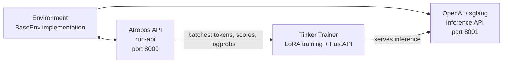

# RL 训练

Hermes Agent 包含一个基于 **Tinker-Atropos** 构建的集成 RL（强化学习）训练流水线。这使得能够使用 GRPO（组相对策略优化）和 LoRA 适配器，在特定环境任务上训练语言模型，整个过程完全通过 Agent 的工具接口进行编排。

## 概述

RL 训练系统由三个组件组成：

1. **Atropos** — 一个轨迹 API 服务器，协调环境交互、管理 rollout 组并计算优势值
2. **Tinker** — 一个训练服务，处理模型权重、LoRA 训练、采样/推理和优化器步骤
3. **环境** — 定义任务、评分和奖励函数的 Python 类（例如，GSM8K 数学问题）

Agent 可以通过一组 `rl_*` 工具来发现环境、配置训练参数、启动训练运行并监控指标。

## 要求

RL 训练需要：

- **Python >= 3.11**（Tinker 包要求）
- **TINKER_API_KEY** — Tinker 训练服务的 API 密钥
- **WANDB_API_KEY** — 用于 Weights & Biases 指标跟踪的 API 密钥
- `tinker-atropos` 子模块（位于 Hermes 根目录下的 `tinker-atropos/` 目录）

```bash
# 设置 API 密钥
hermes config set TINKER_API_KEY your-tinker-key
hermes config set WANDB_API_KEY your-wandb-key
```

当两个密钥都存在且 Python >= 3.11 可用时，`rl` 工具集会自动启用。

## 可用工具

| 工具 | 描述 |
|------|-------------|
| `rl_list_environments` | 发现可用的 RL 环境 |
| `rl_select_environment` | 选择一个环境并加载其配置 |
| `rl_get_current_config` | 查看可配置和锁定的字段 |
| `rl_edit_config` | 修改可配置的训练参数 |
| `rl_start_training` | 启动一个训练运行（生成 3 个进程） |
| `rl_check_status` | 监控训练进度和 WandB 指标 |
| `rl_stop_training` | 停止正在运行的训练任务 |
| `rl_get_results` | 获取最终指标和模型权重路径 |
| `rl_list_runs` | 列出所有活跃和已完成的运行 |
| `rl_test_inference` | 使用 OpenRouter 进行快速推理测试 |

## 工作流程

### 1. 发现环境

```
列出可用的 RL 环境
```

Agent 调用 `rl_list_environments()`，该函数使用 AST 解析扫描 `tinker-atropos/tinker_atropos/environments/` 目录，查找继承自 `BaseEnv` 的 Python 类。每个环境定义：

- **数据集加载** — 训练数据的来源（例如，HuggingFace 数据集）
- **提示词构建** — 如何为模型格式化数据项
- **评分/验证** — 如何评估模型输出并分配奖励

### 2. 选择和配置

```
选择 GSM8K 环境并显示配置
```

Agent 调用 `rl_select_environment("gsm8k_tinker")`，然后调用 `rl_get_current_config()` 查看所有参数。

配置字段分为两类：

**可配置字段**（可以修改）：
- `group_size` — 每个数据项的完成次数（默认：16）
- `batch_size` — 训练批次大小（默认：128）
- `wandb_name` — WandB 运行名称（自动设置为 `{env}-{timestamp}`）
- 其他环境特定参数

**锁定字段**（基础设施设置，无法更改）：
- `tokenizer_name` — 模型分词器（例如 `Qwen/Qwen3-8B`）
- `rollout_server_url` — Atropos API URL（`http://localhost:8000`）
- `max_token_length` — 最大 Token 长度（8192）
- `max_num_workers` — 最大并行工作进程数（2048）
- `total_steps` — 总训练步数（2500）
- `lora_rank` — LoRA 适配器秩（32）
- `learning_rate` — 学习率（4e-5）
- `max_token_trainer_length` — 训练器的最大 Token 数（9000）

### 3. 开始训练

```
启动训练运行
```

Agent 调用 `rl_start_training()`，该函数：

1. 生成一个 YAML 配置文件，合并锁定设置和可配置的覆盖项
2. 创建一个唯一的运行 ID
3. 生成三个进程：
   - **Atropos API 服务器**（`run-api`）— 轨迹协调
   - **Tinker 训练器**（`launch_training.py`）— LoRA 训练 + 端口 8001 上的 FastAPI 推理服务器
   - **环境**（`environment.py serve`）— 连接到 Atropos 的选定环境

进程以交错延迟启动（API 5 秒，训练器 30 秒，环境再 90 秒），以确保正确的初始化顺序。

### 4. 监控进度

```
检查训练运行 abc12345 的状态
```

Agent 调用 `rl_check_status(run_id)`，该函数报告：

- 进程状态（3 个进程中每个进程的运行/退出状态）
- 运行时间
- WandB 指标（步数、奖励均值、正确率百分比、评估准确率）
- 用于调试的日志文件位置

:::note 速率限制
状态检查被限制为每个运行 ID **每 30 分钟一次**。这可以防止在需要数小时的长时训练任务期间进行过多的轮询。
:::

### 5. 停止或获取结果

```
停止训练运行
# 或
获取运行 abc12345 的最终结果
```

`rl_stop_training()` 以相反顺序终止所有三个进程（环境 → 训练器 → API）。`rl_get_results()` 检索最终的 WandB 指标和训练历史。

## 推理测试

在提交完整的训练运行之前，您可以使用 `rl_test_inference` 测试环境是否正常工作。这使用 OpenRouter 运行几个推理和评分步骤——不需要 Tinker API，只需要一个 `OPENROUTER_API_KEY`。

```
使用推理测试选定的环境
```

默认配置：
- **3 步 × 16 次完成 = 每个模型 48 次 rollout**
- 测试 3 个不同规模的模型以确保鲁棒性：
  - `qwen/qwen3-8b`（小）
  - `z-ai/glm-4.7-flash`（中）
  - `minimax/minimax-m2.7`（大）
- 总计：约 144 次 rollout

这验证：
- 环境加载正确
- 提示词构建有效
- 推理响应解析在不同模型规模下具有鲁棒性
- 验证器/评分逻辑产生有效的奖励

## Tinker API 集成

训练器使用 [Tinker](https://tinker.computer) API 进行模型训练操作：

- **ServiceClient** — 创建训练和采样客户端
- **训练客户端** — 处理带有重要性采样损失的前向-后向传播、优化器步骤（Adam）和权重检查点保存
- **采样客户端** — 使用最新训练的权重提供推理

训练循环：
1. 从 Atropos 获取一批 rollout（提示词 + 完成项 + 分数）
2. 转换为带有填充对数概率和优势值的 Tinker Datum 对象
3. 使用重要性采样损失运行前向-后向传播
4. 执行优化器步骤（Adam：lr=4e-5，β1=0.9，β2=0.95）
5. 保存权重并为下一步推理创建新的采样客户端
6. 将指标记录到 WandB

## 架构图



## 创建自定义环境

要创建新的 RL 环境：

1. 在 `tinker-atropos/tinker_atropos/environments/` 中创建一个 Python 文件
2. 定义一个继承自 `BaseEnv` 的类
3. 实现所需的方法：
   - `load_dataset()` — 加载您的训练数据
   - `get_next_item()` — 为模型提供下一个数据项
   - `score_answer()` — 对模型输出进行评分并分配奖励
   - `collect_trajectories()` — 收集并返回轨迹
4. 可选地定义一个继承自 `BaseEnvConfig` 的自定义配置类

研究现有的 `gsm8k_tinker.py` 作为模板。Agent 可以帮助您创建新环境——它可以读取现有的环境文件、检查 HuggingFace 数据集并编写新的环境代码。

## WandB 指标

训练运行会记录到 Weights & Biases，包含以下关键指标：

| 指标 | 描述 |
|--------|-------------|
| `train/loss` | 训练损失（重要性采样） |
| `train/learning_rate` | 当前学习率 |
| `reward/mean` | 各组间的平均奖励 |
| `logprobs/mean` | 平均参考对数概率 |
| `logprobs/mean_training` | 平均训练对数概率 |
| `logprobs/diff` | 对数概率漂移（参考 - 训练） |
| `advantages/mean` | 平均优势值 |
| `advantages/std` | 优势值标准差 |

## 日志文件

每个训练运行都会在 `~/.hermes/logs/rl_training/` 目录下生成日志文件：

```
logs/
├── api_{run_id}.log        # Atropos API 服务器日志
├── trainer_{run_id}.log    # Tinker 训练器日志
├── env_{run_id}.log        # 环境进程日志
└── inference_tests/        # 推理测试结果
    ├── test_{env}_{model}.jsonl
    └── test_{env}_{model}.log
```

当训练失败或产生意外结果时，这些日志对于调试非常宝贵。