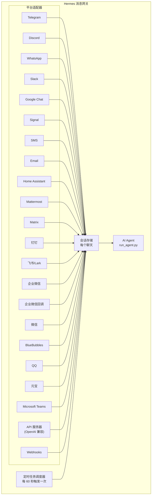

# 消息网关

通过 Telegram、Discord、Slack、WhatsApp、Signal、SMS、Email、Home Assistant、Mattermost、Matrix、钉钉、飞书/Lark、企业微信、微信、BlueBubbles (iMessage)、QQ、元宝、Microsoft Teams、LINE 或您的浏览器与 Hermes 聊天。网关是一个单一的后台进程，连接到所有已配置的平台，处理会话，运行定时任务，并传递语音消息。

要获得完整的语音功能集 — 包括 CLI 麦克风模式、消息中的语音回复以及 Discord 语音频道对话 — 请参阅 [语音模式](/docs/user-guide/features/voice-mode) 和 [使用 Hermes 的语音模式](/docs/guides/use-voice-mode-with-hermes)。

## 平台功能对比

| 平台 | 语音 | 图片 | 文件 | 线程 | 反应 | 输入指示 | 流式传输 |
|----------|:-----:|:------:|:-----:|:-------:|:---------:|:------:|:---------:|
| Telegram | ✅ | ✅ | ✅ | ✅ | — | ✅ | ✅ |
| Discord | ✅ | ✅ | ✅ | ✅ | ✅ | ✅ | ✅ |
| Slack | ✅ | ✅ | ✅ | ✅ | ✅ | ✅ | ✅ |
| Google Chat | — | ✅ | ✅ | ✅ | — | ✅ | — |
| WhatsApp | — | ✅ | ✅ | — | — | ✅ | ✅ |
| Signal | — | ✅ | ✅ | — | — | ✅ | ✅ |
| SMS | — | — | — | — | — | — | — |
| Email | — | ✅ | ✅ | ✅ | — | — | — |
| Home Assistant | — | — | — | — | — | — | — |
| Mattermost | ✅ | ✅ | ✅ | ✅ | — | ✅ | ✅ |
| Matrix | ✅ | ✅ | ✅ | ✅ | ✅ | ✅ | ✅ |
| 钉钉 | — | ✅ | ✅ | — | ✅ | — | ✅ |
| 飞书/Lark | ✅ | ✅ | ✅ | ✅ | ✅ | ✅ | ✅ |
| 企业微信 | ✅ | ✅ | ✅ | — | — | ✅ | ✅ |
| 企业微信回调 | — | — | — | — | — | — | — |
| 微信 | ✅ | ✅ | ✅ | — | — | ✅ | ✅ |
| BlueBubbles | — | ✅ | ✅ | — | ✅ | ✅ | — |
| QQ | ✅ | ✅ | ✅ | — | — | ✅ | — |
| 元宝 | ✅ | ✅ | ✅ | — | — | ✅ | ✅ |
| Microsoft Teams | — | ✅ | — | ✅ | — | ✅ | — |
| LINE | — | ✅ | ✅ | — | — | ✅ | — |

**语音** = TTS 音频回复和/或语音消息转录。**图片** = 发送/接收图片。**文件** = 发送/接收文件附件。**线程** = 线程化对话。**反应** = 消息上的表情符号反应。**输入指示** = 处理时显示正在输入指示器。**流式传输** = 通过编辑进行渐进式消息更新。

## 架构


```mermaid
flowchart TB
    subgraph Gateway["Hermes 消息网关"]
        subgraph Adapters["平台适配器"]
            tg[Telegram]
            dc[Discord]
            wa[WhatsApp]
            sl[Slack]
            gc[Google Chat]
            sig[Signal]
            sms[SMS]
            em[Email]
            ha[Home Assistant]
            mm[Mattermost]
            mx[Matrix]
            dt[钉钉]
    fs[飞书/Lark]
    wc[企业微信]
    wcb[企业微信回调]
    wx[微信]
    bb[BlueBubbles]
    qq[QQ]
    yb[元宝]
    ms[Microsoft Teams]
    api["API 服务器<br/>(OpenAI 兼容)"]
    wh[Webhooks]
        end

        store["会话存储<br/>每个聊天"]
        agent["AI Agent<br/>run_agent.py"]
        cron["定时任务调度器<br/>每 60 秒触发一次"]
    end

    tg --> store
    dc --> store
    wa --> store
    sl --> store
    gc --> store
    sig --> store
    sms --> store
    em --> store
    ha --> store
    mm --> store
    mx --> store
    dt --> store
    fs --> store
    wc --> store
    wcb --> store
    wx --> store
    bb --> store
    qq --> store
    yb --> store
    ms --> store
    api --> store
    wh --> store
    store --> agent
    cron --> store
```

每个平台适配器接收消息，通过每个聊天的会话存储进行路由，并将其分派给 AI Agent 进行处理。网关还运行定时任务调度器，每 60 秒触发一次以执行任何到期的任务。

## 快速设置

配置消息平台最简单的方法是使用交互式向导：

```bash
hermes gateway setup        # 为所有消息平台进行交互式设置
```

这将引导您使用方向键选择来配置每个平台，显示哪些平台已配置，并在完成后提供启动/重启网关的选项。

## 网关命令

```bash
hermes gateway              # 在前台运行
hermes gateway setup        # 交互式配置消息平台
hermes gateway install      # 安装为用户服务 (Linux) / launchd 服务 (macOS)
sudo hermes gateway install --system   # 仅限 Linux：安装启动时系统服务
hermes gateway start        # 启动默认服务
hermes gateway stop         # 停止默认服务
hermes gateway status       # 检查默认服务状态
hermes gateway status --system         # 仅限 Linux：显式检查系统服务状态
```

## 聊天命令 (在消息平台内)

| 命令 | 描述 |
|---------|-------------|
| `/new` 或 `/reset` | 开始新的对话 |
| `/model [provider:model]` | 显示或更改模型 (支持 `provider:model` 语法) |
| `/personality [name]` | 设置一个灵魂（人格） |
| `/retry` | 重试上一条消息 |
| `/undo` | 移除最后一次交互 |
| `/status` | 显示会话信息 |
| `/whoami` | 显示您在此范围内的斜杠命令访问权限 (管理员 / 用户 / 无限制) |
| `/stop` | 停止正在运行的 Agent |
| `/approve` | 批准一个待处理的危险命令 |
| `/deny` | 拒绝一个待处理的危险命令 |
| `/sethome` | 将此聊天设置为家庭频道 |
| `/compress` | 手动压缩对话上下文 |
| `/title [name]` | 设置或显示会话标题 |
| `/resume [name]` | 恢复之前命名的会话 |
| `/usage` | 显示此会话的 Token 使用情况 |
| `/insights [days]` | 显示使用情况洞察和分析 |
| `/reasoning [level\|show\|hide]` | 更改推理强度或切换推理显示 |
| `/voice [on\|off\|tts\|join\|leave\|status]` | 控制消息语音回复和 Discord 语音频道行为 |
| `/rollback [number]` | 列出或恢复文件系统检查点 |
| `/background <prompt>` | 在单独的背景会话中运行提示词 |
| `/reload-mcp` | 从配置重新加载 MCP 服务器 |
| `/update` | 将 Hermes Agent 更新到最新版本 |
| `/help` | 显示可用命令 |
| `/<skill-name>` | 调用任何已安装的技能 |
## 会话管理

### 会话持久性

会话在消息之间持续存在，直到被重置。Agent 会记住您的对话上下文。

### 重置策略

会话根据可配置的策略进行重置：

| 策略 | 默认值 | 描述 |
|--------|---------|-------------|
| 每日 | 凌晨 4:00 | 每天在特定小时重置 |
| 闲置 | 1440 分钟 | 在 N 分钟无活动后重置 |
| 两者 | (组合) | 任一条件先触发即重置 |

在 `~/.hermes/gateway.json` 中配置每个平台的覆盖设置：

```json
{
  "reset_by_platform": {
    "telegram": { "mode": "idle", "idle_minutes": 240 },
    "discord": { "mode": "idle", "idle_minutes": 60 }
  }
}
```

## 安全性

**默认情况下，消息网关会拒绝所有不在允许列表中或未通过私信配对的用户。** 对于具有终端访问权限的机器人来说，这是安全的默认设置。

```bash
# 限制为特定用户（推荐）：
TELEGRAM_ALLOWED_USERS=123456789,987654321
DISCORD_ALLOWED_USERS=123456789012345678
SIGNAL_ALLOWED_USERS=+155****4567,+155****6543
SMS_ALLOWED_USERS=+155****4567,+155****6543
EMAIL_ALLOWED_USERS=trusted@example.com,colleague@work.com
MATTERMOST_ALLOWED_USERS=3uo8dkh1p7g1mfk49ear5fzs5c
MATRIX_ALLOWED_USERS=@alice:matrix.org
DINGTALK_ALLOWED_USERS=user-id-1
FEISHU_ALLOWED_USERS=ou_xxxxxxxx,ou_yyyyyyyy
WECOM_ALLOWED_USERS=user-id-1,user-id-2
WECOM_CALLBACK_ALLOWED_USERS=user-id-1,user-id-2
TEAMS_ALLOWED_USERS=aad-object-id-1,aad-object-id-2

# 或者使用通用允许列表：
GATEWAY_ALLOWED_USERS=123456789,987654321

# 或者显式允许所有用户（对于具有终端访问权限的机器人不推荐）：
GATEWAY_ALLOW_ALL_USERS=true
```

### 私信配对（替代允许列表）

无需手动配置用户 ID，未知用户向机器人发送私信时会收到一个一次性配对码：

```bash
# 用户看到："配对码：XKGH5N7P"
# 您可以通过以下命令批准他们：
hermes pairing approve telegram XKGH5N7P

# 其他配对命令：
hermes pairing list          # 查看待处理 + 已批准的用户
hermes pairing revoke telegram 123456789  # 移除访问权限
```

配对码在 1 小时后过期，有速率限制，并使用加密随机数生成。

### 管理员与普通用户

允许列表回答的是“这个人能否联系到机器人？”而**管理员/用户划分**回答的是“既然他们能联系到，他们被允许做什么？”

每个被允许的用户在每个作用域（私信 vs 群组/频道）下都属于以下两个层级之一：

- **管理员** — 完全访问权限。可以运行每个已注册的斜杠命令（内置 + 插件）并使用每个受限制的功能。
- **普通用户** — 受限访问权限。可以正常与 Agent 聊天，但只能运行您明确启用的斜杠命令。始终允许的最低权限是 `/help` 和 `/whoami`。

层级按平台和作用域配置。私信管理员状态并不意味着群组/频道管理员状态 — 每个作用域都有自己的管理员列表。

**当前层级限制的内容：** 斜杠命令。该划分贯穿实时命令注册表，因此无需为每个功能单独配置，即可覆盖内置命令和插件注册的命令。普通聊天不受影响 — 非管理员仍然可以与 Agent 对话。

**未来可能限制的内容：** 随着我们添加更多功能界面（工具访问、模型切换、高成本操作），它们将基于相同的管理员/用户划分进行限制。现在配置好划分，意味着未来的限制可以清晰地落地，而无需您重新定义谁是管理员。

#### 配置

```yaml
gateway:
  platforms:
    discord:
      extra:
        allow_from: ["111", "222", "333"]
        allow_admin_from: ["111"]                    # 管理员 → 所有斜杠命令
        user_allowed_commands: [status, model]       # 非管理员可以运行的命令
        # 可选：独立的群组/频道作用域配置
        group_allow_admin_from: ["111"]
        group_user_allowed_commands: [status]
```

**向后兼容性：** 如果某个作用域未设置 `allow_admin_from`，则该作用域的层级划分将被禁用，每个被允许的用户都拥有完全访问权限。现有安装无需更改即可继续工作 — 当您需要区分时再选择启用。

#### 检查您的访问权限

在任何平台使用 `/whoami` 命令来查看当前作用域、您的层级（管理员 / 用户 / 无限制）以及您可以运行哪些斜杠命令。请参阅 [Telegram](/docs/user-guide/messaging/telegram#slash-command-access-control) 和 [Discord](/docs/user-guide/messaging/discord#slash-command-access-control) 页面以获取特定于平台的示例。

## 中断 Agent

在 Agent 工作时发送任何消息即可中断它。关键行为：

- **正在进行的终端命令会立即被终止**（SIGTERM，1 秒后 SIGKILL）
- **工具调用被取消** — 只有当前正在执行的那个会运行，其余的被跳过
- **多条消息被合并** — 中断期间发送的消息会被合并到一个提示词中
- **`/stop` 命令** — 中断但不排队后续消息

### 排队 vs 中断 vs 引导（忙碌输入模式）

默认情况下，向忙碌的 Agent 发送消息会中断它。另外还有两种模式可用：

- `queue` — 后续消息会等待，并在当前任务完成后作为下一个回合运行。
- `steer` — 后续消息通过 `/steer` 注入到当前运行中，在下一个工具调用后到达 Agent。不中断，不创建新回合。如果 Agent 尚未开始运行，则回退到 `queue` 行为。

```yaml
display:
  busy_input_mode: steer   # 或 queue，或 interrupt（默认）
  busy_ack_enabled: true   # 设置为 false 以完全抑制聊天回复中的 ⚡/⏳/⏩ 提示
```

在任何平台上首次向忙碌的 Agent 发送消息时，Hermes 会在忙碌确认消息后附加一行提示，解释此设置（`"💡 首次提示 — …"`）。该提示在每个安装中只显示一次 — `onboarding.seen.busy_input_prompt` 下的标志会记录它。删除该键可以再次看到提示。

如果您觉得忙碌确认消息很烦人 — 特别是在语音输入或快速连续发送消息时 — 请将 `display.busy_ack_enabled` 设置为 `false`。您的输入仍会正常排队/引导/中断，只是聊天回复被静音了。

## 工具进度通知
在 `~/.hermes/config.yaml` 中控制工具活动显示的详细程度：

```yaml
display:
  tool_progress: all    # off | new | all | verbose
  tool_progress_command: false  # 设置为 true 以在消息传递中启用 /verbose 命令
```

启用后，机器人会在工作时发送状态消息：

```text
💻 `ls -la`...
🔍 web_search...
📄 web_extract...
🐍 execute_code...
```

## 后台会话

在单独的后台会话中运行提示词，让 Agent 独立处理任务，同时保持主聊天会话的响应性：

```
/background 检查集群中的所有服务器并报告任何宕机的服务器
```

Hermes 会立即确认：

```
🔄 后台任务已启动："检查集群中的所有服务器..."
   任务 ID：bg_143022_a1b2c3
```

### 工作原理

每个 `/background` 提示词都会生成一个**独立的 Agent 实例**，该实例异步运行：

- **隔离的会话** — 后台 Agent 拥有自己的会话和对话历史。它不了解你当前的聊天上下文，只接收你提供的提示词。
- **相同的配置** — 继承你当前的网关设置中的模型、提供商、工具集、推理设置和提供商路由。
- **非阻塞** — 你的主聊天会话保持完全交互性。在后台任务运行时，你可以发送消息、运行其他命令或启动更多后台任务。
- **结果交付** — 当任务完成时，结果会发送回**你发出命令的同一个聊天或频道**，并带有 "✅ 后台任务完成" 前缀。如果失败，你会看到 "❌ 后台任务失败" 以及错误信息。

### 后台进程通知

当运行后台会话的 Agent 使用 `terminal(background=true)` 启动长时间运行的进程（服务器、构建等）时，网关可以将状态更新推送到你的聊天中。通过 `~/.hermes/config.yaml` 中的 `display.background_process_notifications` 来控制此行为：

```yaml
display:
  background_process_notifications: all    # all | result | error | off
```

| 模式 | 接收内容 |
|------|-----------------|
| `all` | 运行中输出更新**以及**最终完成消息（默认） |
| `result` | 仅最终完成消息（无论退出代码如何） |
| `error` | 仅当退出代码非零时的最终消息 |
| `off` | 完全不接收进程监视器消息 |

你也可以通过环境变量设置：

```bash
HERMES_BACKGROUND_NOTIFICATIONS=result
```

### 使用场景

- **服务器监控** — "/background 检查所有服务的健康状况，如果有任何服务宕机则提醒我"
- **长时间构建** — "/background 构建并部署预发布环境"，同时你可以继续聊天
- **研究任务** — "/background 研究竞争对手的定价并以表格形式总结"
- **文件操作** — "/background 按日期将 ~/Downloads 中的照片整理到文件夹中"

:::tip
消息平台上的后台任务是"发射后不管"的 — 你无需等待或检查它们。任务完成后，结果会自动到达同一个聊天中。
:::

## 服务管理

### Linux (systemd)

```bash
hermes gateway install               # 安装为用户服务
hermes gateway start                 # 启动服务
hermes gateway stop                  # 停止服务
hermes gateway status                # 检查状态
journalctl --user -u hermes-gateway -f  # 查看日志

# 启用 lingering（在注销后保持运行）
sudo loginctl enable-linger $USER

# 或者安装一个启动时运行的系统服务，但仍以你的用户身份运行
sudo hermes gateway install --system
sudo hermes gateway start --system
sudo hermes gateway status --system
journalctl -u hermes-gateway -f
```

在笔记本电脑和开发机上使用用户服务。在 VPS 或无头主机上使用系统服务，以确保在启动时恢复运行，而不依赖 systemd linger。

除非确实需要，否则避免同时安装用户和系统网关单元。如果 Hermes 检测到两者同时存在，它会发出警告，因为启动/停止/状态行为会变得不明确。

:::info 多个安装
如果你在同一台机器上运行多个 Hermes 安装（使用不同的 `HERMES_HOME` 目录），每个安装都会有自己的 systemd 服务名称。默认的 `~/.hermes` 使用 `hermes-gateway`；其他安装使用 `hermes-gateway-<hash>`。`hermes gateway` 命令会自动针对你当前 `HERMES_HOME` 的正确服务。
:::

### macOS (launchd)

```bash
hermes gateway install               # 安装为 launchd agent
hermes gateway start                 # 启动服务
hermes gateway stop                  # 停止服务
hermes gateway status                # 检查状态
tail -f ~/.hermes/logs/gateway.log   # 查看日志
```

生成的 plist 文件位于 `~/Library/LaunchAgents/ai.hermes.gateway.plist`。它包含三个环境变量：

- **PATH** — 安装时你的完整 shell PATH，并预先添加了 venv `bin/` 和 `node_modules/.bin`。这确保用户安装的工具（Node.js、ffmpeg 等）对网关子进程（如 WhatsApp 桥接器）可用。
- **VIRTUAL_ENV** — 指向 Python 虚拟环境，以便工具可以正确解析包。
- **HERMES_HOME** — 将网关范围限定到你的 Hermes 安装。

:::tip 安装后的 PATH 变更
launchd plist 是静态的 — 如果在设置网关后安装了新工具（例如，通过 nvm 安装新的 Node.js 版本，或通过 Homebrew 安装 ffmpeg），请再次运行 `hermes gateway install` 以捕获更新后的 PATH。网关会检测到过时的 plist 并自动重新加载。
:::

:::info 多个安装
与 Linux systemd 服务类似，每个 `HERMES_HOME` 目录都有自己的 launchd 标签。默认的 `~/.hermes` 使用 `ai.hermes.gateway`；其他安装使用 `ai.hermes.gateway-<suffix>`。
:::

## 平台特定工具集

每个平台都有自己的工具集：

| 平台 | 工具集 | 能力 |
|----------|---------|--------------|
| CLI | `hermes-cli` | 完全访问 |
| Telegram | `hermes-telegram` | 包括终端在内的完整工具 |
| Discord | `hermes-discord` | 包括终端在内的完整工具 |
| WhatsApp | `hermes-whatsapp` | 包括终端在内的完整工具 |
| Slack | `hermes-slack` | 包括终端在内的完整工具 |
| Google Chat | `hermes-google_chat` | 包括终端在内的完整工具 |
| Signal | `hermes-signal` | 包括终端在内的完整工具 |
| SMS | `hermes-sms` | 包括终端在内的完整工具 |
| Email | `hermes-email` | 包括终端在内的完整工具 |
| Home Assistant | `hermes-homeassistant` | 完整工具 + HA 设备控制 (ha_list_entities, ha_get_state, ha_call_service, ha_list_services) |
| Mattermost | `hermes-mattermost` | 包括终端在内的完整工具 |
| Matrix | `hermes-matrix` | 包括终端在内的完整工具 |
| DingTalk | `hermes-dingtalk` | 包括终端在内的完整工具 |
| Feishu/Lark | `hermes-feishu` | 包括终端在内的完整工具 |
| WeCom | `hermes-wecom` | 包括终端在内的完整工具 |
| WeCom Callback | `hermes-wecom-callback` | 包括终端在内的完整工具 |
| Weixin | `hermes-weixin` | 包括终端在内的完整工具 |
| BlueBubbles | `hermes-bluebubbles` | 包括终端在内的完整工具 |
| QQBot | `hermes-qqbot` | 包括终端在内的完整工具 |
| Yuanbao | `hermes-yuanbao` | 包括终端在内的完整工具 |
| Microsoft Teams | `hermes-teams` | 包括终端在内的完整工具 |
| API Server | `hermes-api-server` | 完整工具（移除了 `clarify`、`send_message`、`text_to_speech` — 程序化访问没有交互式用户） |
| Webhooks | `hermes-webhook` | 包括终端在内的完整工具 |
## 运行多平台消息网关

消息网关通常同时运行多个适配器（Telegram + Discord + Slack 等）。以下部分涵盖了跨所有平台的日常运维操作。

### `/platform` 命令

消息网关运行后，可以从任何已连接的 CLI 会话或聊天中使用 `/platform` 斜杠命令来检查和操控单个适配器，而无需重启整个消息网关：

```
/platform list                  # 显示所有适配器及其状态
/platform pause <name>          # 停止向一个适配器分发新消息
/platform resume <name>         # 重新启用一个已暂停的适配器
```

`/platform list` 会显示每个适配器是 `running`（运行中）、`paused`（手动暂停）还是 `paused-by-breaker`（断路器暂停，见下文）。暂停操作会保持适配器已加载且其后台循环存活——传入的消息会被丢弃，但连接本身保持打开状态，因此恢复是即时的。

另请参阅更广泛的状态摘要命令 [`/platforms`](../../reference/slash-commands.md#info)。

### 自动断路器

每个适配器都包装在一个断路器中。可重试的重复故障（网络波动、速率限制响应、上游 5xx 响应、WebSocket 断开连接）会导致断路器跳闸——适配器会自动暂停，当配置了其他活动平台时，会向该平台的主频道发送操作员通知，并输出一条结构化日志行。

断路器**不会**自动恢复——它会保持打开状态，直到您手动运行 `/platform resume <name>`。这是有意为之的：如果某个平台持续中断，您不会希望消息网关反复尝试重连。

### 平台暂停时查看位置

当适配器暂停时，请检查：

1.  **消息网关日志** (`~/.hermes/logs/gateway.log` 或 systemd / launchd 单元日志)。搜索平台名称以及 `circuit breaker`、`paused` 或 `disabled`。跳闸事件包含故障计数和最后一个错误。
2.  **`/platform list`** 输出——显示当前状态和最后原因。
3.  **提供商的状态页面**（Telegram Bot API 状态、Discord 状态等）。断路器跳闸是因为平台不健康；在其恢复之前不要尝试恢复。

一旦上游服务恢复健康，运行 `/platform resume <name>` 将清除断路器并重新激活适配器。

### 重启通知

当消息网关重启（或在有进行中会话时关闭）时，它可以向每个平台的主频道发送一次性的“Agent 已恢复”/“Agent 被中断”消息。这由 `gateway-config.yaml` 中每个平台的 `gateway_restart_notification` 标志控制，默认为 `true`：

```yaml
gateway:
  platforms:
    telegram:
      home_chat_id: "123456789"
      gateway_restart_notification: false   # 为此平台选择退出
    discord:
      home_chat_id: "987654321"
      # gateway_restart_notification 省略 → 默认为 true
```

可以在嘈杂或低优先级的平台上禁用它，同时在您的主要聊天中保持启用。无论有多少个会话正在进行中，每次重启只发送一次通知。

### 跨消息网关重启的会话恢复

当消息网关在有进行中的工具调用或生成时关闭，受影响的会话会被标记为 `restart_interrupted`。在下一次启动时，消息网关会为每个此类会话安排自动恢复——用户在聊天中会收到一个简短的提示（“重启后发送任何消息，我将尝试从您离开的地方恢复。”），当他们回复时，会话会从最后提交的轮次继续。

此行为默认启用，并在消息网关启动时记录：

```
Scheduled auto-resume for N restart-interrupted session(s)
```

无需配置。如果您不想要提示，请在平台上设置 `gateway_restart_notification: false`。

### 进度气泡清理（可选）

工具进度消息、“仍在工作…”心跳和状态回调气泡可以在最终响应到达后自动删除。通过 `display.platforms.<platform>.cleanup_progress` 按平台启用：

```yaml
display:
  platforms:
    telegram:
      cleanup_progress: true
    discord:
      cleanup_progress: true
```

默认为 `false`。只有适配器实现了 `delete_message` 的平台才会遵循此设置（目前是 Telegram 和 Discord）。失败的运行会**跳过**清理，因此气泡会保留作为线索。

## 后续步骤

- [Telegram 设置](telegram.md)
- [Discord 设置](discord.md)
- [Slack 设置](slack.md)
- [Google Chat 设置](google_chat.md)
- [WhatsApp 设置](whatsapp.md)
- [Signal 设置](signal.md)
- [SMS 设置 (Twilio)](sms.md)
- [电子邮件设置](email.md)
- [Home Assistant 集成](homeassistant.md)
- [Mattermost 设置](mattermost.md)
- [Matrix 设置](matrix.md)
- [钉钉设置](dingtalk.md)
- [飞书/Lark 设置](feishu.md)
- [企业微信设置](wecom.md)
- [企业微信回调设置](wecom-callback.md)
- [微信设置](weixin.md)
- [BlueBubbles 设置 (iMessage)](bluebubbles.md)
- [QQBot 设置](qqbot.md)
- [元宝设置](yuanbao.md)
- [Microsoft Teams 设置](teams.md)
- [Teams 会议流水线](teams-meetings.md)
- [Open WebUI + API 服务器](open-webui.md)
- [Webhooks](webhooks.md)