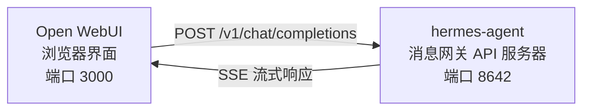

# Open WebUI 集成

[Open WebUI](https://github.com/open-webui/open-webui) (126k★) 是最受欢迎的自托管 AI 聊天界面。借助 Hermes Agent 内置的 API 服务器，您可以将 Open WebUI 用作 Agent 的精美 Web 前端——具备完整的对话管理、用户账户和现代化的聊天界面。

## 架构



Open WebUI 连接到 Hermes Agent 的 API 服务器，就像连接到 OpenAI 一样。您的 Agent 会使用其完整的工具集（终端、文件操作、网络搜索、记忆、技能）处理请求，并返回最终响应。

Open WebUI 与 Hermes 是服务器对服务器通信，因此此集成不需要 `API_SERVER_CORS_ORIGINS`。

## 快速设置

### 1. 启用 API 服务器

添加到 `~/.hermes/.env`：

```bash
API_SERVER_ENABLED=true
API_SERVER_KEY=your-secret-key
```

### 2. 启动 Hermes Agent 消息网关

```bash
hermes gateway
```

您应该看到：

```
[API Server] API server listening on http://127.0.0.1:8642
```

### 3. 启动 Open WebUI

```bash
docker run -d -p 3000:8080 \
  -e OPENAI_API_BASE_URL=http://host.docker.internal:8642/v1 \
  -e OPENAI_API_KEY=your-secret-key \
  --add-host=host.docker.internal:host-gateway \
  -v open-webui:/app/backend/data \
  --name open-webui \
  --restart always \
  ghcr.io/open-webui/open-webui:main
```

### 4. 打开界面

访问 **http://localhost:3000**。创建您的管理员账户（第一个用户将成为管理员）。您应该在模型下拉列表中看到您的 Agent（以您的配置文件命名，或默认配置文件的 **hermes-agent**）。开始聊天吧！

## Docker Compose 设置

对于更持久的设置，创建一个 `docker-compose.yml`：

```yaml
services:
  open-webui:
    image: ghcr.io/open-webui/open-webui:main
    ports:
      - "3000:8080"
    volumes:
      - open-webui:/app/backend/data
    environment:
      - OPENAI_API_BASE_URL=http://host.docker.internal:8642/v1
      - OPENAI_API_KEY=your-secret-key
    extra_hosts:
      - "host.docker.internal:host-gateway"
    restart: always

volumes:
  open-webui:
```

然后：

```bash
docker compose up -d
```

## 通过管理界面配置

如果您更喜欢通过界面而不是环境变量来配置连接：

1. 登录 Open WebUI **http://localhost:3000**
2. 点击您的**个人资料头像** → **管理设置**
3. 转到 **连接**
4. 在 **OpenAI API** 下，点击**扳手图标**（管理）
5. 点击 **+ 添加新连接**
6. 输入：
   - **URL**：`http://host.docker.internal:8642/v1`
   - **API 密钥**：您的密钥或任何非空值（例如 `not-needed`）
7. 点击**对勾**验证连接
8. **保存**

您的 Agent 模型现在应该出现在模型下拉列表中（以您的配置文件命名，或默认配置文件的 **hermes-agent**）。

:::warning
环境变量仅在 Open WebUI **首次启动**时生效。之后，连接设置会存储在其内部数据库中。要稍后更改它们，请使用管理界面或删除 Docker 卷并重新开始。
:::

## API 类型：Chat Completions 与 Responses

Open WebUI 在连接到后端时支持两种 API 模式：

| 模式 | 格式 | 何时使用 |
|------|--------|-------------|
| **Chat Completions**（默认） | `/v1/chat/completions` | 推荐。开箱即用。 |
| **Responses**（实验性） | `/v1/responses` | 用于通过 `previous_response_id` 实现服务器端对话状态。 |

### 使用 Chat Completions（推荐）

这是默认模式，无需额外配置。Open WebUI 发送标准 OpenAI 格式的请求，Hermes Agent 相应回复。每个请求都包含完整的对话历史。

### 使用 Responses API

要使用 Responses API 模式：

1. 转到 **管理设置** → **连接** → **OpenAI** → **管理**
2. 编辑您的 hermes-agent 连接
3. 将 **API 类型** 从 "Chat Completions" 更改为 **"Responses (Experimental)"**
4. 保存

使用 Responses API 时，Open WebUI 以 Responses 格式（`input` 数组 + `instructions`）发送请求，Hermes Agent 可以通过 `previous_response_id` 在多个回合中保留完整的工具调用历史。

:::note
Open WebUI 目前在 Responses 模式下仍以客户端方式管理对话历史——它在每个请求中发送完整的消息历史，而不是使用 `previous_response_id`。Responses API 模式主要对未来前端演进时的兼容性有用。
:::

## 工作原理

当您在 Open WebUI 中发送消息时：

1. Open WebUI 发送一个 `POST /v1/chat/completions` 请求，包含您的消息和对话历史
2. Hermes Agent 创建一个具有完整工具集的 AIAgent 实例
3. Agent 处理您的请求——它可能会调用工具（终端、文件操作、网络搜索等）
4. 当工具执行时，**内联进度消息会流式传输到界面**，以便您可以看到 Agent 正在做什么（例如 `` `💻 ls -la` ``, `` `🔍 Python 3.12 release` ``）
5. Agent 的最终文本响应流式传输回 Open WebUI
6. Open WebUI 在其聊天界面中显示响应

您的 Agent 可以访问与使用 CLI 或 Telegram 时相同的所有工具和功能——唯一的区别是前端。

:::tip 工具进度
启用流式传输（默认）后，您将在工具运行时看到简短的内联指示器——工具表情符号及其关键参数。这些会在 Agent 最终答案之前出现在响应流中，让您了解幕后发生的情况。
:::

## 配置参考

### Hermes Agent（API 服务器）

| 变量 | 默认值 | 描述 |
|----------|---------|-------------|
| `API_SERVER_ENABLED` | `false` | 启用 API 服务器 |
| `API_SERVER_PORT` | `8642` | HTTP 服务器端口 |
| `API_SERVER_HOST` | `127.0.0.1` | 绑定地址 |
| `API_SERVER_KEY` | _(必填)_ | 用于身份验证的 Bearer token。与 `OPENAI_API_KEY` 匹配。 |

### Open WebUI

| 变量 | 描述 |
|----------|-------------|
| `OPENAI_API_BASE_URL` | Hermes Agent 的 API URL（包含 `/v1`） |
| `OPENAI_API_KEY` | 必须非空。与您的 `API_SERVER_KEY` 匹配。 |

## 故障排除

### 下拉列表中没有模型出现

- **检查 URL 是否有 `/v1` 后缀**：`http://host.docker.internal:8642/v1`（不仅仅是 `:8642`）
- **验证消息网关正在运行**：`curl http://localhost:8642/health` 应返回 `{"status": "ok"}`
- **检查模型列表**：`curl http://localhost:8642/v1/models` 应返回包含 `hermes-agent` 的列表
- **Docker 网络**：从 Docker 内部，`localhost` 指的是容器，而不是您的主机。使用 `host.docker.internal` 或 `--network=host`。

### 连接测试通过但模型未加载

这几乎总是因为缺少 `/v1` 后缀。Open WebUI 的连接测试是基本的连通性检查——它不验证模型列表是否有效。

### 响应时间很长

Hermes Agent 可能在生成最终响应之前执行多个工具调用（读取文件、运行命令、搜索网络）。这对于复杂查询是正常的。当 Agent 完成时，响应会一次性出现。

### "Invalid API key" 错误

确保 Open WebUI 中的 `OPENAI_API_KEY` 与 Hermes Agent 中的 `API_SERVER_KEY` 匹配。

## 多用户配置文件设置

要为每个用户运行独立的 Hermes 实例——每个实例都有自己的配置、记忆和技能——请使用[配置文件](/docs/user-guide/features/profiles)。每个配置文件在不同的端口上运行自己的 API 服务器，并自动在 Open WebUI 中将配置文件名称作为模型名称进行通告。

### 1. 创建配置文件并配置 API 服务器

```bash
hermes profile create alice
hermes -p alice config set API_SERVER_ENABLED true
hermes -p alice config set API_SERVER_PORT 8643
hermes -p alice config set API_SERVER_KEY alice-secret

hermes profile create bob
hermes -p bob config set API_SERVER_ENABLED true
hermes -p bob config set API_SERVER_PORT 8644
hermes -p bob config set API_SERVER_KEY bob-secret
```

### 2. 启动每个消息网关

```bash
hermes -p alice gateway &
hermes -p bob gateway &
```

### 3. 在 Open WebUI 中添加连接

在 **管理设置** → **连接** → **OpenAI API** → **管理** 中，为每个配置文件添加一个连接：

| 连接 | URL | API 密钥 |
|-----------|-----|---------|
| Alice | `http://host.docker.internal:8643/v1` | `alice-secret` |
| Bob | `http://host.docker.internal:8644/v1` | `bob-secret` |

模型下拉列表将显示 `alice` 和 `bob` 作为不同的模型。您可以通过管理面板将模型分配给 Open WebUI 用户，为每个用户提供自己独立的 Hermes Agent。

:::tip 自定义模型名称
模型名称默认为配置文件名称。要覆盖它，请在配置文件的 `.env` 中设置 `API_SERVER_MODEL_NAME`：
```bash
hermes -p alice config set API_SERVER_MODEL_NAME "Alice's Agent"
```
:::

## Linux Docker（无 Docker Desktop）

在没有 Docker Desktop 的 Linux 上，`host.docker.internal` 默认无法解析。选项：

```bash
# 选项 1：添加主机映射
docker run --add-host=host.docker.internal:host-gateway ...

# 选项 2：使用主机网络
docker run --network=host -e OPENAI_API_BASE_URL=http://localhost:8642/v1 ...

# 选项 3：使用 Docker 网桥 IP
docker run -e OPENAI_API_BASE_URL=http://172.17.0.1:8642/v1 ...
```