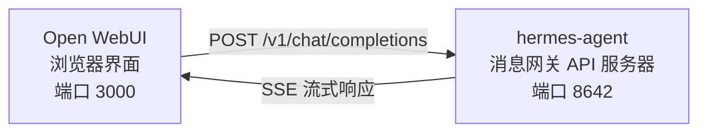

# Open WebUI 集成

[Open WebUI](https://github.com/open-webui/open-webui) (126k★) 是最受欢迎的自托管 AI 聊天界面。借助 Hermes Agent 内置的 API 服务器，您可以将 Open WebUI 用作您 Agent 的精美 Web 前端——具备完整的对话管理、用户账户和现代化的聊天界面。

## 架构


```mermaid
flowchart LR
    A["Open WebUI<br/>浏览器界面<br/>端口 3000"]
    B["hermes-agent<br/>消息网关 API 服务器<br/>端口 8642"]
    A -->|POST /v1/chat/completions| B
    B -->|SSE 流式响应| A
```

Open WebUI 连接到 Hermes Agent 的 API 服务器，就像连接到 OpenAI 一样。Hermes 使用其完整的工具集——终端、文件操作、网络搜索、记忆、技能——处理请求并返回最终响应。

:::important 运行时位置
API 服务器是一个 **Hermes Agent 运行时**，而不是一个纯粹的 LLM 代理。对于每个请求，Hermes 会在 API 服务器主机上创建一个服务器端的 `AIAgent`。工具调用在运行该 API 服务器的地方执行。

例如，如果一台笔记本电脑将 Open WebUI 或另一个 OpenAI 兼容的客户端指向远程机器上的 Hermes API 服务器，那么 `pwd`、文件工具、浏览器工具、本地 MCP 工具和其他工作空间工具将在远程 API 服务器主机上运行，而不是在笔记本电脑上。
:::

Open WebUI 与 Hermes 是服务器到服务器的通信，因此您不需要为此集成配置 `API_SERVER_CORS_ORIGINS`。

## 快速设置

### 一键本地引导（macOS/Linux，无需 Docker）

如果您希望 Hermes + Open WebUI 在本地通过可重复使用的启动器连接在一起，请运行：

```bash
cd ~/.hermes/hermes-agent
bash scripts/setup_open_webui.sh
```

该脚本的作用：

- 确保 `~/.hermes/.env` 包含 `API_SERVER_ENABLED`、`API_SERVER_HOST`、`API_SERVER_KEY`、`API_SERVER_PORT` 和 `API_SERVER_MODEL_NAME`
- 重启 Hermes 消息网关以使 API 服务器启动
- 将 Open WebUI 安装到 `~/.local/open-webui-venv`
- 在 `~/.local/bin/start-open-webui-hermes.sh` 写入一个启动器
- 在 macOS 上，安装一个 `launchd` 用户服务；在带有 `systemd --user` 的 Linux 上，在那里安装一个用户服务

默认值：

- Hermes API：`http://127.0.0.1:8642/v1`
- Open WebUI：`http://127.0.0.1:8080`
- 向 Open WebUI 通告的模型名称：`Hermes Agent`

有用的覆盖选项：

```bash
OPEN_WEBUI_NAME='My Hermes UI' \
OPEN_WEBUI_ENABLE_SIGNUP=true \
HERMES_API_MODEL_NAME='My Hermes Agent' \
bash scripts/setup_open_webui.sh
```

在 Linux 上，自动后台服务设置需要一个正常工作的 `systemd --user` 会话。如果您在无头 SSH 机器上并希望跳过服务安装，请运行：

```bash
OPEN_WEBUI_ENABLE_SERVICE=false bash scripts/setup_open_webui.sh
```

### 1. 启用 API 服务器

```bash
hermes config set API_SERVER_ENABLED true
hermes config set API_SERVER_KEY your-secret-key
```

`hermes config set` 会自动将标志路由到 `config.yaml`，并将密钥路由到 `~/.hermes/.env`。如果消息网关已经在运行，请重启它以使更改生效：

```bash
hermes gateway stop && hermes gateway
```

### 2. 启动 Hermes Agent 消息网关

```bash
hermes gateway
```

您应该会看到：

```
[API Server] API server listening on http://127.0.0.1:8642
```

### 3. 验证 API 服务器可访问

```bash
curl -s http://127.0.0.1:8642/health
# {"status": "ok", ...}

curl -s -H "Authorization: Bearer your-secret-key" http://127.0.0.1:8642/v1/models
# {"object":"list","data":[{"id":"hermes-agent", ...}]}
```

如果 `/health` 失败，说明消息网关没有获取到 `API_SERVER_ENABLED=true`——请重启它。如果 `/v1/models` 返回 `401`，说明您的 `Authorization` 请求头与 `API_SERVER_KEY` 不匹配。

### 4. 启动 Open WebUI

```bash
docker run -d -p 3000:8080 \
  -e OPENAI_API_BASE_URL=http://host.docker.internal:8642/v1 \
  -e OPENAI_API_KEY=your-secret-key \
  -e ENABLE_OLLAMA_API=false \
  --add-host=host.docker.internal:host-gateway \
  -v open-webui:/app/backend/data \
  --name open-webui \
  --restart always \
  ghcr.io/open-webui/open-webui:main
```

`ENABLE_OLLAMA_API=false` 会抑制默认的 Ollama 后端，否则它会显示为空并弄乱模型选择器。如果您确实同时运行着 Ollama，请省略此参数。

首次启动需要 15-30 秒：Open WebUI 在第一次启动时会下载 sentence-transformer 嵌入模型（约 150MB）。在打开 UI 之前，请等待 `docker logs open-webui` 的输出稳定下来。

### 5. 打开 UI

访问 **http://localhost:3000**。创建您的管理员账户（第一个用户将成为管理员）。您应该在模型下拉列表中看到您的 Agent（以您的配置文件命名，或者对于默认配置文件是 **hermes-agent**）。开始聊天吧！

## Docker Compose 设置

对于更持久的设置，创建一个 `docker-compose.yml`：

```yaml
services:
  open-webui:
    image: ghcr.io/open-webui/open-webui:main
    ports:
      - "3000:8080"
    volumes:
      - open-webui:/app/backend/data
    environment:
      - OPENAI_API_BASE_URL=http://host.docker.internal:8642/v1
      - OPENAI_API_KEY=your-secret-key
      - ENABLE_OLLAMA_API=false
    extra_hosts:
      - "host.docker.internal:host-gateway"
    restart: always

volumes:
  open-webui:
```

然后：

```bash
docker compose up -d
```

## 通过管理界面配置

如果您更喜欢通过 UI 而不是环境变量来配置连接：

1. 登录到 **http://localhost:3000** 的 Open WebUI
2. 点击您的 **个人资料头像** → **管理设置**
3. 进入 **连接**
4. 在 **OpenAI API** 下，点击 **扳手图标**（管理）
5. 点击 **+ 添加新连接**
6. 输入：
   - **URL**：`http://host.docker.internal:8642/v1`
   - **API 密钥**：与 Hermes 中 `API_SERVER_KEY` 完全相同的值
7. 点击 **对勾** 验证连接
8. **保存**

您的 Agent 模型现在应该出现在模型下拉列表中（以您的配置文件命名，或者对于默认配置文件是 **hermes-agent**）。

:::warning
环境变量仅在 Open WebUI **首次启动**时生效。之后，连接设置会存储在其内部数据库中。要稍后更改它们，请使用管理界面或删除 Docker 卷并重新开始。
:::
## API 类型：Chat Completions 与 Responses

Open WebUI 在连接到后端时支持两种 API 模式：

| 模式 | 格式 | 何时使用 |
|------|--------|-------------|
| **Chat Completions**（默认） | `/v1/chat/completions` | 推荐。开箱即用。 |
| **Responses**（实验性） | `/v1/responses` | 用于通过 `previous_response_id` 实现服务器端会话状态。 |

### 使用 Chat Completions（推荐）

这是默认模式，无需额外配置。Open WebUI 发送标准 OpenAI 格式的请求，Hermes Agent 会相应回复。每个请求都包含完整的对话历史。

### 使用 Responses API

要使用 Responses API 模式：

1. 进入 **Admin Settings** → **Connections** → **OpenAI** → **Manage**
2. 编辑你的 hermes-agent 连接
3. 将 **API Type** 从 "Chat Completions" 更改为 **"Responses (Experimental)"**
4. 保存

使用 Responses API 时，Open WebUI 以 Responses 格式（`input` 数组 + `instructions`）发送请求，并且 Hermes Agent 可以通过 `previous_response_id` 在多轮对话中保留完整的工具调用历史。当 `stream: true` 时，Hermes 还会流式传输规范原生的 `function_call` 和 `function_call_output` 项，这使客户端能够呈现 Responses 事件，从而实现自定义的结构化工具调用 UI。

:::note
即使在 Responses 模式下，Open WebUI 目前仍在客户端管理对话历史——它在每个请求中发送完整的消息历史记录，而不是使用 `previous_response_id`。如今 Responses 模式的主要优势在于结构化的事件流：文本增量、`function_call` 和 `function_call_output` 项作为 OpenAI Responses SSE 事件到达，而不是 Chat Completions 块。
:::

## 工作原理

当你在 Open WebUI 中发送消息时：

1.  Open WebUI 发送一个 `POST /v1/chat/completions` 请求，包含你的消息和对话历史
2.  Hermes Agent 使用 API 服务器的配置文件、模型/提供商配置、记忆、技能和配置的 API 服务器工具集，创建一个服务器端的 `AIAgent` 实例
3.  Agent 处理你的请求——它可能会调用 API 服务器主机上的工具（终端、文件操作、网络搜索等）
4.  当工具执行时，**内联进度消息会流式传输到 UI**，以便你可以看到 Agent 正在做什么（例如 `` `💻 ls -la` ``, `` `🔍 Python 3.12 release` ``）
5.  Agent 的最终文本响应流式传输回 Open WebUI
6.  Open WebUI 在其聊天界面中显示响应

你的 Agent 可以访问与该 API 服务器 Hermes 实例相同的工具和能力。如果 API 服务器是远程的，那么这些工具也是远程的。

如果你目前需要工具针对你的**本地**工作空间运行，请在本地运行 Hermes，并将其指向纯 LLM 提供商或纯 OpenAI 兼容的模型代理（例如 vLLM、LiteLLM、Ollama、llama.cpp、OpenAI、OpenRouter 等）。未来用于“远程大脑，本地操作”的分体运行时模式正在 [#18715](https://github.com/NousResearch/hermes-agent/issues/18715) 中跟踪；这不是当前 API 服务器的行为。

:::tip 工具进度
启用流式传输（默认）后，你将在工具运行时看到简短的内联指示器——工具表情符号及其关键参数。这些会在 Agent 最终答案之前出现在响应流中，让你了解幕后正在发生什么。
:::

## 配置参考

### Hermes Agent（API 服务器）

| 变量 | 默认值 | 描述 |
|----------|---------|-------------|
| `API_SERVER_ENABLED` | `false` | 启用 API 服务器 |
| `API_SERVER_PORT` | `8642` | HTTP 服务器端口 |
| `API_SERVER_HOST` | `127.0.0.1` | 绑定地址 |
| `API_SERVER_KEY` | _(必填)_ | 用于身份验证的 Bearer Token。需与 `OPENAI_API_KEY` 匹配。 |

### Open WebUI

| 变量 | 描述 |
|----------|-------------|
| `OPENAI_API_BASE_URL` | Hermes Agent 的 API URL（包含 `/v1`） |
| `OPENAI_API_KEY` | 必须非空。需与你的 `API_SERVER_KEY` 匹配。 |

## 故障排除

### 下拉列表中不显示模型

-   **检查 URL 是否包含 `/v1` 后缀**：`http://host.docker.internal:8642/v1`（不仅仅是 `:8642`）
-   **验证消息网关是否正在运行**：`curl http://localhost:8642/health` 应返回 `{"status": "ok"}`
-   **检查模型列表**：`curl -H "Authorization: Bearer your-secret-key" http://localhost:8642/v1/models` 应返回包含 `hermes-agent` 的列表
-   **Docker 网络**：在 Docker 内部，`localhost` 指的是容器，而不是你的主机。请使用 `host.docker.internal` 或 `--network=host`。
-   **空的 Ollama 后端遮蔽了选择器**：如果你省略了 `ENABLE_OLLAMA_API=false`，Open WebUI 会在你的 Hermes 模型上方显示一个空的 Ollama 部分。使用 `-e ENABLE_OLLAMA_API=false` 重启容器，或在 **Admin Settings → Connections** 中禁用 Ollama。

### 连接测试通过但模型未加载

这几乎总是因为缺少 `/v1` 后缀。Open WebUI 的连接测试是基本的连通性检查——它不验证模型列表是否正常工作。

### 响应时间很长

Hermes Agent 可能在生成最终响应之前执行多个工具调用（读取文件、运行命令、搜索网络）。这对于复杂查询是正常的。当 Agent 完成时，响应会一次性出现。

### "Invalid API key" 错误

确保 Open WebUI 中的 `OPENAI_API_KEY` 与 Hermes Agent 中的 `API_SERVER_KEY` 匹配。

:::warning
Open WebUI 在首次启动后，会将其 OpenAI 兼容的连接设置保存在自己的数据库中。如果你在 Admin UI 中不小心保存了错误的密钥，仅修复环境变量是不够的——需要在 **Admin Settings → Connections** 中更新或删除已保存的连接，或者重置 Open WebUI 的数据目录/数据库。
:::

## 使用配置文件的多用户设置

要为每个用户运行独立的 Hermes 实例——每个实例都有自己的配置、记忆和技能——请使用[配置文件](/user-guide/profiles)。每个配置文件在不同的端口上运行自己的 API 服务器，并自动将配置文件名称作为模型在 Open WebUI 中公布。

### 1. 创建配置文件并配置 API 服务器

`API_SERVER_*` 是环境变量，不是 YAML 配置键，因此请将它们写入每个配置文件的 `.env` 文件中。选择默认平台范围之外的端口（`8644` 是 webhook 适配器，`8645` 是 wecom-callback，`8646` 是 msgraph-webhook），例如 `8650+`：
```bash
hermes profile create alice
cat >> ~/.hermes/profiles/alice/.env <<EOF
API_SERVER_ENABLED=true
API_SERVER_PORT=8650
API_SERVER_KEY=alice-secret
EOF

hermes profile create bob
cat >> ~/.hermes/profiles/bob/.env <<EOF
API_SERVER_ENABLED=true
API_SERVER_PORT=8651
API_SERVER_KEY=bob-secret
EOF
```

### 2. 启动每个消息网关

```bash
hermes -p alice gateway &
hermes -p bob gateway &
```

### 3. 在 Open WebUI 中添加连接

在 **Admin Settings** → **Connections** → **OpenAI API** → **Manage** 中，为每个配置文件添加一个连接：

| 连接 | URL | API 密钥 |
|-----------|-----|---------|
| Alice | `http://host.docker.internal:8650/v1` | `alice-secret` |
| Bob | `http://host.docker.internal:8651/v1` | `bob-secret` |

模型下拉菜单将显示 `alice` 和 `bob` 作为不同的模型。您可以通过管理面板将模型分配给 Open WebUI 用户，从而为每个用户提供他们自己独立的 Hermes Agent。

:::tip 自定义模型名称
模型名称默认为配置文件名称。要覆盖它，请在配置文件的 `.env` 中设置 `API_SERVER_MODEL_NAME`：
```bash
hermes -p alice config set API_SERVER_MODEL_NAME "Alice's Agent"
```
:::

## Linux Docker（无 Docker Desktop）

在没有 Docker Desktop 的 Linux 上，默认情况下 `host.docker.internal` 无法解析。选项：

```bash
# 选项 1：添加主机映射
docker run --add-host=host.docker.internal:host-gateway ...

# 选项 2：使用主机网络
docker run --network=host -e OPENAI_API_BASE_URL=http://localhost:8642/v1 ...

# 选项 3：使用 Docker 网桥 IP
docker run -e OPENAI_API_BASE_URL=http://172.17.0.1:8642/v1 ...
```