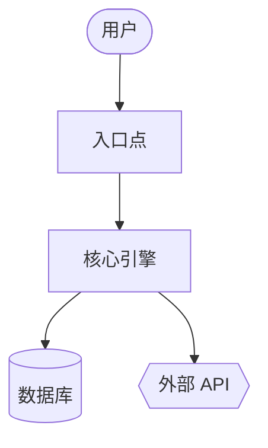
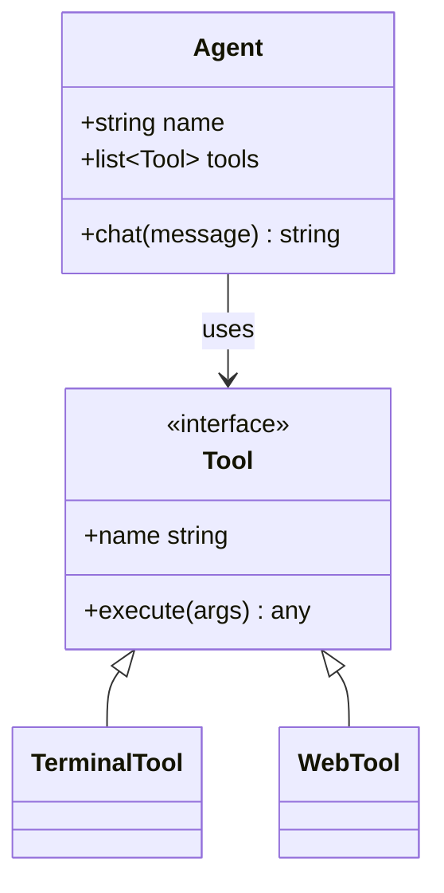
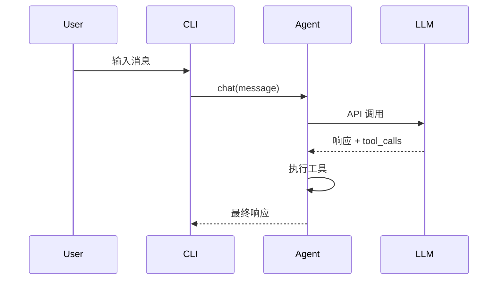

{/* 此页面由技能的 SKILL.md 通过 website/scripts/generate-skill-docs.py 自动生成。请编辑源文件 SKILL.md，而非此页面。 */}

# 代码维基

为任何代码库生成维基文档 + Mermaid 图表。

## 技能元数据

| | |
|---|---|
| 来源 | 可选 — 使用 `hermes skills install official/software-development/code-wiki` 安装 |
| 路径 | `optional-skills/software-development/code-wiki` |
| 版本 | `0.1.0` |
| 作者 | Teknium (teknium1), Hermes Agent |
| 许可证 | MIT |
| 平台 | linux, macos, windows |
| 标签 | `Documentation`, `Mermaid`, `Architecture`, `Diagrams`, `Wiki`, `Code-Analysis` |
| 相关技能 | [`codebase-inspection`](/docs/user-guide/skills/bundled/github/github-codebase-inspection), [`github-repo-management`](/docs/user-guide/skills/bundled/github/github-github-repo-management) |

## 参考：完整的 SKILL.md

:::info
以下是 Hermes 触发此技能时加载的完整技能定义。这是 Agent 在技能激活时看到的指令。
:::

# 代码维基技能

为任何代码库生成全面的维基 — 概述、架构、按模块深度分析、Mermaid 类和序列图。灵感来自 Google CodeWiki，但适用于本地仓库、私有仓库和任何语言。仅使用现有的 Hermes 工具（`terminal`、`read_file`、`search_files`、`write_file`）；无需 Docker、无需外部服务、无需额外依赖。

此技能生成**参考文档**（是什么/怎么做）。它不生成战略叙述（为什么 — 那是另一个技能）。

## 使用时机

- 用户说“为这个代码库写文档”、“生成维基”、“制作架构图”
- 加入一个不熟悉的仓库并需要结构化的参考
- 用户指向一个 GitHub URL 并要求生成文档
- 需要可在 GitHub 上渲染的稳定产物（markdown + Mermaid）

**不要**将此技能用于：
- 单文件或单函数的文档 — 直接回答即可
- 特定端点的 API 参考 — 使用 `read_file` 并内联回答
- 战略性的“为什么存在”叙述 — 不同技能，不同目的
- 用户在当前会话中正在积极开发的代码库 — 直接回答问题即可

## 先决条件

- 无需环境变量。
- 用于仓库 SHA 跟踪和远程克隆的 `git` 在 PATH 中。
- 可选：用于语言统计细分的 `pygount`（参见 `codebase-inspection` 技能）。

## 如何运行

从目标仓库的根目录通过 `terminal` 工具调用，然后使用 `read_file` / `search_files` / `write_file` 生成维基。默认输出位置是 `~/.hermes/wikis/<repo-name>/`。仅当用户明确请求时才写入仓库（`docs/wiki/`）。

## 快速参考

| 步骤 | 操作 |
|---|---|
| 1 | 解析目标 — 本地 cwd、给定路径，或 `git clone --depth 50 <url>` 到临时目录 |
| 2 | 扫描结构 — `ls`、`find -maxdepth 3`、清单文件、README |
| 3 | 选择 8–10 个要记录的模块 |
| 4 | 编写 `README.md`（概述 + 模块映射） |
| 5 | 编写带 Mermaid 流程图的 `architecture.md` |
| 6 | 在 `modules/` 中编写每个模块的文档 |
| 7 | 编写 `diagrams/class-diagram.md`（Mermaid classDiagram） |
| 8 | 编写 `diagrams/sequences.md`（Mermaid sequenceDiagram，2–4 个工作流） |
| 9 | 编写 `getting-started.md` |
| 10 | 编写 `api.md`（如果适用），否则跳过 |
| 11 | 编写 `.codewiki-state.json` |
| 12 | 向用户报告路径 |

## 流程

### 1. 解析目标

对于 GitHub URL：

```bash
WIKI_TMP=$(mktemp -d)
git clone --depth 50 <url> "$WIKI_TMP/repo"
cd "$WIKI_TMP/repo"
REPO_SHA=$(git rev-parse HEAD)
REPO_NAME=$(basename <url> .git)
```

对于本地路径（如果未给出，则为 cwd）：

```bash
cd <path>
REPO_SHA=$(git rev-parse HEAD 2>/dev/null || echo "uncommitted")
REPO_NAME=$(basename "$PWD")
```

然后设置输出目录：

```bash
OUTPUT_DIR="$HOME/.hermes/wikis/$REPO_NAME"
mkdir -p "$OUTPUT_DIR/modules" "$OUTPUT_DIR/diagrams"
```

### 2. 扫描仓库结构

使用 `terminal` 工具进行 shell 工作，使用 `read_file` 读取清单：

```bash
# 先浅层树
ls -la

# 更深层的树，过滤噪音
find . -type d \
  -not -path '*/\.*' \
  -not -path '*/node_modules*' \
  -not -path '*/venv*' \
  -not -path '*/__pycache__*' \
  -not -path '*/dist*' \
  -not -path '*/build*' \
  -not -path '*/target*' \
  -maxdepth 3 | sort

# 语言细分（如果 pygount 不可用则跳过）
pygount --format=summary \
  --folders-to-skip=".git,node_modules,venv,.venv,__pycache__,.cache,dist,build,target" \
  . 2>/dev/null || true
```

然后 `read_file` 读取相关清单（`package.json`、`pyproject.toml`、`setup.py`、`Cargo.toml`、`go.mod`、`pom.xml`、`build.gradle`）和项目 README。使用 `search_files target='files'` 来查找它们，而不是猜测名称。

### 3. 选择要记录的模块

初始阶段限制在 **8–10 个模块**。按语言的启发式方法：

- Python：顶级包（包含 `__init__.py` 的目录），加上子系统目录
- JS/TS：`src/<subdir>`，顶级工作空间目录
- Rust：工作空间中的每个 crate，或顶级 `src/<module>` 目录
- Go：每个顶级包目录
- 混合/不熟悉的：包含源代码的顶级目录（非配置，非测试）

对于非常大的仓库，按以下优先级排序：
1. 被导入次数（被许多模块导入的是核心）
2. 代码行数（较大的模块通常需要自己的文档）
3. 在 README / 顶级文档中提及

在大型仓库上生成每个模块的文档之前，向用户说明模块列表 — 给他们一个重定向的机会。

### 4. 编写 `README.md`

`read_file` 读取实际的项目 README 以及前 2–3 个入口点文件。然后 `write_file`：

````markdown
# <项目名称>

<一段话：它是什么以及它的用途。自包含 — 不要假设读者有源代码 README。>

## 关键概念

- **<概念 1>** — <一行>
- **<概念 2>** — <一行>

## 入口点

- [`path/to/main.py`](https://github.com/NousResearch/hermes-agent/blob/main/optional-skills/software-development/code-wiki/<link>) — <启动时运行的内容>
- [`path/to/cli.py`](https://github.com/NousResearch/hermes-agent/blob/main/optional-skills/software-development/code-wiki/<link>) — <CLI 界面>

## 高层架构

<2-3 句话。细节在 architecture.md 中。>

参见 [architecture.md](https://github.com/NousResearch/hermes-agent/blob/main/optional-skills/software-development/code-wiki/architecture.md)。

## 模块映射

| 模块 | 用途 |
|---|---|
| [`<模块>`](https://github.com/NousResearch/hermes-agent/blob/main/optional-skills/software-development/code-wiki/modules/<模块>.md) | <一行用途> |

## 快速开始

参见 [getting-started.md](https://github.com/NousResearch/hermes-agent/blob/main/optional-skills/software-development/code-wiki/getting-started.md)。
````
对于本地模式下的链接目标，请使用相对路径。对于克隆的仓库，请使用 `https://github.com/<owner>/<repo>/blob/<sha>/<path>` 格式，以便链接在未来的提交中保持有效。

### 5. 编写 `architecture.md`

````markdown
# 架构

<2-3 段：系统形态。各组件如何交互。数据从哪里进入，从哪里退出，状态存储在哪里。>

## 组件

- **<组件>** — <1-2 句话描述>。参见 [`modules/<module>.md`](https://github.com/NousResearch/hermes-agent/blob/main/optional-skills/software-development/code-wiki/modules/<module>.md)。

## 系统图



## 数据流

1.  **<步骤>** — [`<file>`](https://github.com/NousResearch/hermes-agent/blob/main/optional-skills/software-development/code-wiki/<link>)
2.  **<步骤>** — [`<file>`](https://github.com/NousResearch/hermes-agent/blob/main/optional-skills/software-development/code-wiki/<link>)

## 关键设计决策

- <任何读者应该知道的、支撑系统的重要设计>
````

**Mermaid 图形语义：**
- `[]` = 组件
- `[()]` = 数据库 / 存储
- `{{}}` = 外部服务
- `(())` = 入口点或终端
- `-->` = 同步调用，`-.->` = 异步/事件调用

每个图限制在约 20 个节点以内。如果更大，请拆分为子图。

### 6. 在 `modules/` 目录下编写每个模块的文档

对于每个选定的模块，使用 `ls` 检查其布局，识别 3-5 个最重要的文件（根据文件大小、是否命名为 `core.py` / `main.py` / `__init__.py`、是否被频繁导入），然后 `read_file` 这些文件（使用 `offset` / `limit` 仅读取所需部分；对于特定符号，优先使用 `search_files`）。

````markdown
# 模块：`<module>`

<1-2 句话说明其目的。>

## 职责

- <要点>
- <要点>

## 关键文件

- [`<module>/<file>`](https://github.com/NousResearch/hermes-agent/blob/main/optional-skills/software-development/code-wiki/<link>) — <它做什么>

## 公共 API

<其他代码使用的函数/类/常量。对相关项进行分组。展示签名，而非完整实现。>

## 内部结构

<模块内部如何组织。状态管理。>

## 依赖关系

- **被以下模块使用：** <其他模块>
- **使用以下模块：** <其他模块 + 外部库>

## 值得注意的模式 / 陷阱

- <任何非显而易见之处>
````

### 7. 编写 `diagrams/class-diagram.md`

选取 5-10 个最重要的类/类型。`read_file` 读取它们，然后编写：

````markdown
# 类图

## 核心类型



## 说明

<任何图表无法表达的内容 — 生命周期、线程等。>
````

对于没有类的语言（Go, C, Rust）：使用图表表示结构体关系，或者跳过 class-diagram.md，在 architecture.md 中用文字说明。不要生搬硬套。

### 8. 编写 `diagrams/sequences.md`

选取 2-4 个最重要的工作流。追踪每个调用路径（读取入口点，跟随函数调用），然后：

````markdown
# 序列图

## 工作流：<名称>

<一句话描述此工作流的作用以及何时运行。>



### 逐步说明

1.  **用户输入** — [`cli.py:HermesCLI.run_session`](https://github.com/NousResearch/hermes-agent/blob/main/optional-skills/software-development/code-wiki/<link>)
2.  **消息分发** — [`run_agent.py:AIAgent.chat`](https://github.com/NousResearch/hermes-agent/blob/main/optional-skills/software-development/code-wiki/<link>)
````

不要虚构参与者。每个方框必须对应代码中读者可以找到的真实组件。

### 9. 编写 `getting-started.md`

````markdown
# 快速开始

## 先决条件

<根据清单文件和 README。要具体 — 如果版本固定，请注明版本。>

## 安装

```bash
<确切的命令>
```

## 首次运行

```bash
<用于看到系统执行一些有用操作的最小命令>
```

## 常见工作流

### <工作流 1>
<命令>

## 配置

- `<config-file>` — <它控制什么>
- 环境变量 `<VAR>` — <它控制什么>

## 后续步骤

- 架构：[architecture.md](https://github.com/NousResearch/hermes-agent/blob/main/optional-skills/software-development/code-wiki/architecture.md)
- 模块参考：[README.md#module-map](https://github.com/NousResearch/hermes-agent/blob/main/optional-skills/software-development/code-wiki/README.md#module-map)
````

### 10. 编写 `api.md`（如不适用则跳过）

仅当项目是库或 API 服务器时才编写此文件。如果是：

- 找到公共 API 接口（`__init__.py` 导出项、OpenAPI 规范、路由处理器、导出的类型）
- 记录每个公共入口点，包括签名、参数、返回类型、一行描述
- 按类别分组

### 11. 编写状态文件

```bash
cat > "$OUTPUT_DIR/.codewiki-state.json" <<EOF
{
  "repo_name": "$REPO_NAME",
  "source_path": "$PWD",
  "source_sha": "$REPO_SHA",
  "generated_at": "$(date -u +%Y-%m-%dT%H:%M:%SZ)",
  "generator": "hermes-agent code-wiki skill v0.1.0",
  "modules_documented": []
}
EOF
```

### 12. 向用户报告

准确说明生成了什么以及生成位置：

```
在 ~/.hermes/wikis/<repo-name>/ 生成了 wiki：
  README.md                   项目概述，模块映射
  architecture.md             系统架构 + 流程图
  getting-started.md          设置、首次运行、工作流
  modules/<N 个文件>          每个模块的深入解析
  diagrams/architecture.md    Mermaid 流程图
  diagrams/class-diagram.md   Mermaid 类图
  diagrams/sequences.md       Mermaid 序列图
```
如果你克隆到了临时目录，请提醒用户在查看完 wiki 后可以将其删除（`rm -rf "$WIKI_TMP"`）。

## 范围控制

为一个 50 万行代码的单体仓库生成完整的 wiki 会消耗极其昂贵的 Token。默认采用有限范围：

- 初始扫描：最大目录深度为 3
- 每个模块的文档：除非用户扩展范围，否则上限为 10 个模块
- 每个文件的读取：优先使用 `search_files` 搜索符号，并结合 `read_file` 的 `offset`/`limit` 参数，而不是完整读取
- 跳过供应商代码（`vendor/`、`third_party/`、生成的代码、`_pb2.py`、`.min.js`）

如果用户说“彻底地做完整件事”，请相信他们——但首先要预估成本：“这个仓库有大约 340 个源文件，全面覆盖将非常昂贵——确认吗？”

## 重新运行 / 更新

如果目标路径下已存在 `.codewiki-state.json`：

- 读取它以获取之前的 SHA 和模块列表
- 如果源 SHA 匹配：询问用户是否要重新生成或跳过
- 如果 SHA 不同：提议仅重新生成文件有变更的模块（`git diff --name-only <old-sha> HEAD`）

完整的增量重新生成是未来的增强功能——目前，重新生成整个 wiki 是可以接受的。

## 陷阱

- **虚构组件。** 每个图表节点和声称的函数调用都必须在源代码中。在编写前先使用 `read_file`。自动生成文档最大的失败模式就是听起来合理的虚构。
- **通用的 AI 措辞。** “此模块负责……”是空洞无物的。要用特定领域的术语说明模块实际做了什么。
- **将代码重述为散文。** 一个模块文档写着“`process` 函数通过在每个项目上调用 `process_item` 来处理事情”，这比仅仅链接到该函数还要糟糕。
- **Mermaid 节点超过 50 个。** 它们无法清晰渲染。请拆分它们。
- **将测试、生成的代码或供应商依赖当作产品代码来记录。** 跳过它们。
- **未经询问就在仓库内输出。** 默认输出到 `~/.hermes/wikis/`。只有当用户明确请求时，才写入仓库。
- **Mermaid 特殊字符需要引号：** 使用 `A["Tool / Agent"]`，而不是 `A[Tool / Agent]`。节点内部换行使用 `<br>`。
- **SKILL.md 中的嵌套代码块。** 当编写包含 Mermaid 块的 Markdown 示例时，使用 4 个反引号作为外层围栏，这样内部的 3 个反引号 ` ```mermaid ` 就不会关闭外层围栏。（本 SKILL.md 就是这样做的。）
- **classDiagram 泛型** 渲染为 `~T~`（例如 `List~Tool~`），而不是 `<T>`。
- **GitHub Mermaid 主题是固定的**——不要包含 `%%{init: ...}%%` 块；它们在渲染时会被剥离。

## 验证

编写完成后，请验证：

1. **Mermaid 块平衡**——每个文件中打开和关闭的数量相等：
   ```bash
   for f in "$OUTPUT_DIR"/diagrams/*.md "$OUTPUT_DIR"/architecture.md; do
     opens=$(grep -c '^```mermaid' "$f")
     total=$(grep -c '^```' "$f")
     echo "$f: $opens mermaid blocks, $total total fences (expect total = opens*2)"
   done
   ```
2. **所有预期文件都存在**——
   ```bash
   ls "$OUTPUT_DIR"/{README.md,architecture.md,getting-started.md,.codewiki-state.json} \
      "$OUTPUT_DIR"/modules/ "$OUTPUT_DIR"/diagrams/
   ```
3. **模块数量符合预期**——`ls "$OUTPUT_DIR/modules" | wc -l` 应该等于你在步骤 3 中承诺的模块数量。
4. **没有虚构的路径**——抽查 2-3 个源链接，确保它们能解析到真实的文件。